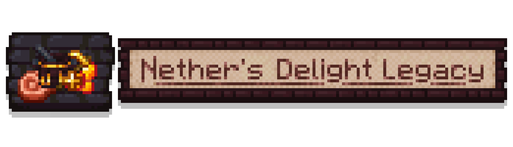

# Nether's Delight Legacy

## Overview
### About

Nether's Delight Legacy is an addon mod for Farmer's Delight Legacy centered around adding culinary content to the Nether on Minecraft `1.12.2`.

Using advanced hunting techniques and culinary skills, you can prepare a variety of infernal meals, moss-covered snacks, and other Nether-themed foods while making the dimension a little more survivable.

This project is a `1.12.2` legacy port and adaptation of the modern Forge version of Nether's Delight, with content and behavior adjusted for the older environment where needed.

### Required Dependencies

- `FarmersDelightLegacy`
- At least one of:
  - `Netherized`
  - `Unseens Nether Backport`

### Optional Compatibility

- `Future-MC`
- `JEI`

## Features

- New Nether foods, ingredients, and hunting-related materials
- Nether-themed cooking pot and cutting board recipes
- Machetes and hunting-tool special drops
- Soul Compost and Rich Soul Soil progression
- Fungus colonies, Mimicarnation, Propelplant, and related plant systems
- Stuffed Hoglin feast block
- Blackstone Stove support
- JEI compatibility for decomposition and hunting-drop displays

## Original Mod

Original modern-version project:

- [Chefs-Delight / NethersDelight_Forge](https://github.com/Chefs-Delight/NethersDelight_Forge)
